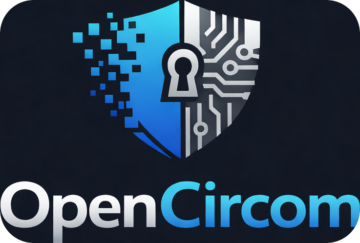

# opencircom



[](LICENSE)
[](https://docs.circom.io/)
[](./test)
[](https://nodejs.org/)
[](./circuits)

Reusable Circom ZK circuit templates: hashing (Poseidon, MiMC, SHA-256), comparators, Merkle trees, nullifiers, voting, and utilities. No dependency on circomlib. Internal security audit applied in 0.5.0.

## Use in your project

Add the `circuits` folder to your include path and include templates:

```circom
include "opencircom/circuits/hashing/poseidon.circom";
include "opencircom/circuits/comparators.circom";
include "opencircom/circuits/merkle/merkle_inclusion.circom";

template MyCircuit(levels) {
    signal input secret;
    signal input pathElements[levels];
    signal input pathIndices[levels];
    signal output root;

    component hasher = Poseidon(1);
    hasher.inputs[0] <== secret;

    component tree = MerkleInclusionProof(levels);
    tree.leaf <== hasher.out;
    for (var i = 0; i < levels; i++) {
        tree.pathElements[i] <== pathElements[i];
        tree.pathIndices[i] <== pathIndices[i];
    }
    root <== tree.root;
}
```

If you clone or link this repo as `opencircom` in your project root, compile with:

```bash
circom your.circom --r1cs --wasm -o build -l opencircom/circuits
```

## Include in Hardhat or Foundry

### Install

From npm:

```bash
npm install opencircom
```

Or add to your `package.json`: `"opencircom": "^0.5.0"`.

### Hardhat

1. Add `opencircom` as a dependency (see Install).
2. In your Circom build step (e.g. Hardhat plugin or script), pass the package circuits as the include path:

   ```bash
   circom circuits/YourCircuit.circom --r1cs --wasm -o build -l node_modules/opencircom/circuits
   ```

3. Use snarkjs (or your flow) to generate the verifier contract; deploy or import it in your Hardhat tests.

### Foundry

1. Add `opencircom` via npm (`npm install opencircom`) or as a Git submodule:
   ```bash
   git submodule add https://github.com/jose-blockchain/opencircom.git lib/opencircom
   ```
2. In a script, run `circom` with the opencircom circuits on the include path:
   - npm: `-l node_modules/opencircom/circuits`
   - submodule: `-l lib/opencircom/circuits`
3. Use snarkjs (or circom) to generate the Solidity verifier; put the generated `.sol` in `src/`.
4. Run `forge build` and `forge test`; your Solidity code calls the verifier contract as usual.

### Boilerplates

Starter repos that wire opencircom with a build pipeline and verifier contracts:

- **opencircom-hardhat-boilerplate** — Circom + snarkjs + Hardhat; compile circuits, generate verifier, test from JS.
- **opencircom-foundry-boilerplate** — Circom + snarkjs + Foundry; verifier in `src/`, `forge test` for Solidity tests.

Use them to jump-start a project without configuring the toolchain from scratch.

## Documentation

API-style docs for each circuit category and template are **generated** (not committed). To build them:

```bash
npm run docs
```

Output is written to **docs/** (see [docs/README.md](./docs/README.md) after generation). The script parses OpenZeppelin-style `@title`, `@notice`, `@dev`, `@param`, `@custom:input`, `@custom:output` block comments in the circuit files.

## Circuits

| Category   | Template                 | Description |
|-----------|--------------------------|-------------|
| Hashing   | `Poseidon(nInputs)`      | Hades Poseidon (configurable width). |
| Hashing   | `PoseidonEncrypt()`      | Symmetric encryption: ciphertext = plaintext + Poseidon(key); decryption off-chain. |
| Hashing   | `MiMC7(nrounds)`, `MultiMiMC7(nInputs, nRounds)` | MiMC-7. |
| Hashing   | `Sha256(nBits)`  | SHA-256 (FIPS 180-4). Input length in bits; padding is applied. |
| Comparators | `LessThan(n)`, `GreaterThan(n)`, `IsEqual()`, `IsZero()`, `AssertNotEqual()` | Range, equality, aliasing-safe (force a ≠ b). |
| Comparators | `StrictNum2Bits(n)` | Num2Bits with in ∈ [0, 2^n−1] enforced. |
| Comparators | `RangeProof(n)` | Prove a ≤ x ≤ b (inputs x, a, b; n-bit range). |
| Bitify    | `Num2Bits(n)`, `Bits2Num(n)` | Bit decomposition (see also `compconstant.circom`, `aliascheck.circom`). |
| Gates     | `AND`, `OR`, `NOT`, `XOR`, `MultiAND(n)` | Boolean gates. |
| Utils     | `Mux1`, `Mux2`, `MuxN` / `SelectByIndex(N, nBits)`, `Switcher` | Multiplexer and conditional swap; N-way select by index. |
| Arithmetic | `Sum(n)`, `InnerProduct(n)`, `DivRem(n)`, `ExpByBits(n)` | Sum, dot product; safe div/rem; field exponentiation (exp as bits). |
| Utils      | `PadBits(n, target)`, `OneOfN(n)`, `IndexOf(N, nBits)` | Zero-pad bits; 1 if value in array; prove index where arr[i]==value. |
| Utils      | `Min2(n)`, `Max2(n)` | Minimum / maximum of two n-bit values. |
| Utils      | `MinN(n, N)`, `MaxN(n, N)` | Minimum / maximum of an array of N n-bit values. |
| Utils      | `AllEqual(n)`, `CountMatches(N)` | 1 if all array elements equal; count of arr[i]==value. |
| Utils      | `Tally(numChoices, numVotes)` | Vote counts per choice (votes in [0, numChoices−1]); for anonymous tally. |
| Utils      | `PadBits10Star(n, totalBits)` | Pad bits with 1 then zeros (hash-style padding). |
| Utils      | `PadPKCS7(blockBytes)` | PKCS#7-style padding: bytes from numUsed to end equal (blockBytes − numUsed); for hashing/symmetric crypto. |
| Utils      | `ConditionalSelect()` | Private if-then-else: out = condition ? a : b (condition 0/1). |
| Utils      | `BalanceProof(n)` | Prove balance ≥ amount and newBalance = balance − amount; for transfer proofs. |
| Utils      | `VoteInAllowlist(n)` | 1 if vote in allowedChoices (allowlist voting). |
| Merkle    | `MerkleInclusionProof(levels)` | Binary Merkle inclusion. |
| Merkle    | `AllowlistMembership(levels)` | Prove identity in allowlist (Poseidon(1)(identity) + Merkle path); use with nullifier on-chain. |
| Merkle    | `SparseMerkleInclusion(levels)`, `SparseMerkleExclusion(levels)` | Sparse Merkle: prove leaf at key equals value, or is empty. |
| Merkle    | `IncrementalMerkleInclusion(levels)` | Append-only tree: prove leaf at numeric index. |
| Merkle    | `MerkleUpdateProof(levels)` | Prove old root → new root by changing one leaf on the same path. |
| Set membership | `AccumulatorMembership(n)` | Field-based accumulator: prove witness^member = accumulator (uses PoEVerify). Build A = g^(∏ elements); witness for e is g^(∏/e). |
| Identity  | `IdentityCommitment()`, `SemaphoreMembership(levels)` | Semaphore-style commitment = Poseidon(identity, secret); prove (identity, secret) in allowlist tree. Use with Nullifier. |
| Identity  | `Nullifier(domainSize)`  | Nullifier hash for double-spend prevention. |
| Voting    | `VoteCommit(numChoices)`, `VoteCommitAllowlist(n)`, `VoteReveal()` | Commit-reveal; allowlist variant constrains choice to allowedChoices[n]; double-vote prevention (nullifier-based). |
| MACI      | `MACICommandPack()`, `MACICommandUnpack()`, `MACICommandHash()`, `MACISharedKeyHash()` | MACI v1 command packing and hashes ([spec](https://maci.pse.dev/docs/v1.2/spec)). |
| MACI      | `MACIMessageEncrypt()`, `MACIMessageDecrypt()`, `MACIMessageHash()` | Additive Poseidon keystream message encryption (composable; full DuplexSponge is coordinator-side in MACI). |
| MACI      | `MACIVoteCommit()`, `MACIVoteDecryptVerify(n)` | Encrypt command+signature plaintext; coordinator verifies decrypted vote in allowlist with nonce/poll checks. |
| String & data | `Utf8Validation(n)`, `FixedStringMatch(n)`, `BytesAllInRange(n, lo, hi)`, `ByteInRange(lo, hi)` | UTF-8 byte-sequence validation; fixed string equality; bytes in [lo, hi] (e.g. digits). |

## Implemented (roadmap coverage)

- **Arithmetic**: Sum(n), InnerProduct(n), DivRem(n) (safe div/rem, all operands range-checked), ExpByBits(n), AssertNotEqual().
- **Set membership**: Merkle allowlist (`AllowlistMembership`), sparse Merkle inclusion/exclusion, incremental and update proofs; accumulator-based (`AccumulatorMembership(n)` — witness^member = accumulator, uses PoEVerify).
- **Payments**: Balance proof (`BalanceProof(n)` — balance ≥ amount, newBalance = balance − amount).
- **Padding**: PadBits, PadBits10Star (1||0*), PadPKCS7 (block bytes).
- **Symmetric encryption**: Poseidon-based (`PoseidonEncrypt()` — ciphertext = plaintext + Poseidon(key); decryption off-chain).
- **Identity & credentials**: Semaphore-style commitment (`IdentityCommitment()`, `SemaphoreMembership(levels)` — prove (identity, secret) in allowlist; use with Nullifier). Age/threshold proofs: use `RangeProof(n)` (a = threshold, b = max).
- **Voting**: Commit-reveal with nullifier, allowlist variant (`VoteCommitAllowlist`), tally (`Tally`).
- **MACI**: Command pack/unpack/hash, shared-key binding, message encrypt/decrypt, `MACIVoteCommit`, `MACIVoteDecryptVerify` (MACI v1 layout; EdDSA/ECDH off-circuit).
- **String & data**: UTF-8 validation (`Utf8Validation(n)`), fixed string match (`FixedStringMatch(n)`), bytes-in-range (`BytesAllInRange(n, lo, hi)`, `ByteInRange(lo, hi)`).

## Roadmap (potential additions)

Planned or community-requested; not yet implemented:

- **Hashing**: Pedersen (Baby Jubjub) and Keccak-256 are deferred (high constraint cost / implementation effort); Poseidon, MiMC, and SHA-256 remain the supported primitives.
- **Signatures**: EdDSA verify (Baby JubJub) and ECDSA verify (secp256k1) are deferred (high constraint cost / implementation effort).
- **Encryption**: ElGamal and ECDH shared secret deferred (curve cost). Symmetric (Poseidon-based) implemented as `PoseidonEncrypt()`.
- **Identity & credentials**: Semaphore-style commitment implemented (`IdentityCommitment`, `SemaphoreMembership`). Selective disclosure buildable from RangeProof + Merkle + commitments. Age/threshold: use `RangeProof(n)`.
- **Set membership**: Accumulator-based membership implemented (`AccumulatorMembership(n)`, uses PoEVerify). Merkle/sparse already done.
- **Payments**: Confidential transfer and mixer (deposit/withdraw) deferred to application repos; build with Merkle, Nullifier, BalanceProof from this lib.
- **String & data**: UTF-8 validation and simple fixed/range patterns implemented; full regex and JSON field extraction deferred.
- **Utilities**: Other padding or encoding schemes (e.g. ISO padding, length-prefix, base64 in-circuit) deferred; PadBits, PadBits10Star, PadPKCS7 remain.

Contributions welcome; open an issue to propose or prioritize.

## Security

- **Range checks**: Use `StrictNum2Bits(n)` or `RangeProof(n)` for untrusted inputs; `LessThan(n)` assumes inputs &lt; 2^n.
- **Merkle**: `pathIndices[i]` are constrained binary in-circuit; `Switcher` constrains `sel` to {0,1}.
- **Nullifier**: Use a unique `externalNullifier` per action to avoid cross-action replay.
- **Hashing**: Poseidon uses standard Hades parameters (same as circomlib); constants in `circuits/hashing/poseidon_constants.circom`.
- **Audit**: An internal security audit (0.5.0) fixed binary constraints and range checks in Switcher, ForceEqualIfEnabled, IncrementalMerkleInclusion, DivRem, and PadPKCS7. See [CHANGELOG](CHANGELOG) for details.

See [SECURITY.md](SECURITY.md) for more.

## Tests

Tests use **real** ZK where applicable: circuits are compiled with Circom, then a small Powers of Tau and zkey are generated, and a Groth16 proof is created and verified with snarkjs (no mocks).

**Coverage** (253+ tests): Poseidon, PoseidonEncrypt, SHA-256, Comparators, IdentityCommitment, SemaphoreMembership, AccumulatorMembership, Gates, Bitify, Merkle (inclusion, AllowlistMembership, sparse, incremental, update), MiMC, Mux1/Mux2, MuxN, Arithmetic (incl. PoEVerify), Utils (PadBits, PadBits10Star, PadPKCS7, OneOfN, IndexOf, Min2, Max2, MinN, MaxN, AllEqual, CountMatches, Tally, ConditionalSelect, BalanceProof, VoteInAllowlist), String (Utf8Validation, FixedStringMatch, BytesAllInRange), Switcher, VoteCommitAllowlist, Nullifier, Voting, and one full Groth16 prove/verify.

```bash
npm install
npm test
```

The first run runs `setup:zk` (ptau + zkey generation) and can take about a minute.

## License

MIT
